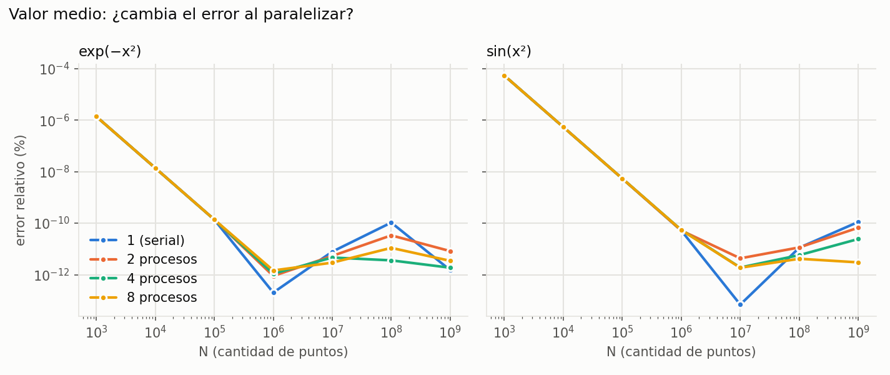
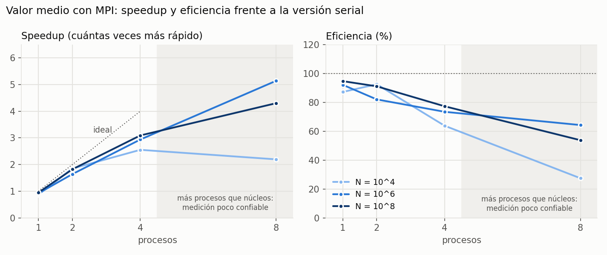
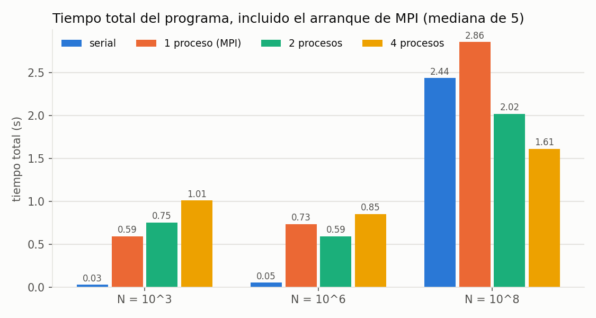
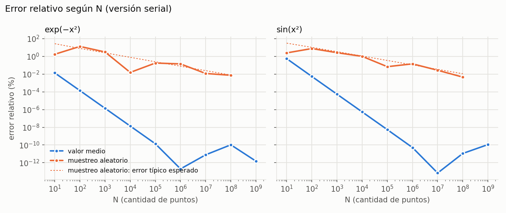
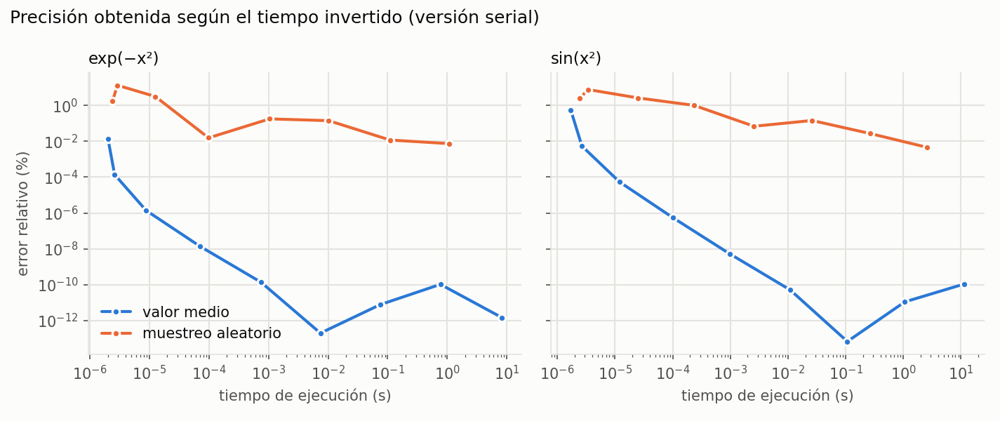

# Mediciones

Mediciones de _tiempo_ de los métodos.

# Resultados de Mediciones (Tomas)

## Entorno

| | |
| :--- | :--- |
| Fecha | 2026-10-03 |
| CPU | AMD Ryzen 3 3200G: **4 núcleos** (4 hilos) |
| RAM | 16 GB |
| Sistema | Windows 10 + WSL 1 (Ubuntu 24.04) |
| Compilador | gcc 13.3.0 |
| MPI | OpenMPI 4.1.6 |

## Cómo se midió

- **Funciones:** $e^{-x^2}$ y $\sin(x^2)$ en el intervalo **[0, 2]**.
- **N:** de $10^3$ a $10^9$.
- **Procesos:** 1 (serial), 2, 4 y 8. La CPU tiene 4 núcleos, así que con 8 hay más procesos que núcleos.
- **Tiempo:** promedio de **10 ejecuciones** (3 para $N = 10^9$). Mide solo el cálculo, sin el arranque del programa. Igual que en los programas originales.

## Método de valor medio

### Mediciones para $e^{-x^2}$

Para calcular el error relativo se utiliza un valor de referencia igual a $0.8820813907$. Tiempo: promedio de 10 ejecuciones (3 para $N = 10^9$).

| $N$ (Simulaciones) | Procesos | Tiempo de Ejecución (segs) | Valor Aproximado | Error Relativo (%) |
| :--- | :--- | :--- | :--- | :--- |
| $N = 1 \times 10^3$ | 1 (serial) | 0.000009 | 0.8820814030 | 1.4e-06 |
| $N = 1 \times 10^4$ | 1 (serial) | 0.000071 | 0.8820813909 | 1.4e-08 |
| $N = 1 \times 10^5$ | 1 (serial) | 0.000751 | 0.8820813908 | 1.4e-10 |
| $N = 1 \times 10^6$ | 1 (serial) | 0.007425 | 0.8820813908 | 2.0e-13 |
| $N = 1 \times 10^7$ | 1 (serial) | 0.075072 | 0.8820813908 | 7.8e-12 |
| $N = 1 \times 10^8$ | 1 (serial) | 0.767207 | 0.8820813908 | 1.1e-10 |
| $N = 1 \times 10^9$ | 1 (serial) | 8.206291 | 0.8820813908 | 1.5e-12 |

| $N$ (Simulaciones) | Procesos | Tiempo de Ejecución (segs) | Valor Aproximado | Error Relativo (%) |
| :--- | :--- | :--- | :--- | :--- |
| $N = 1 \times 10^3$ | 2 | 0.000015 | 0.8820814030 | 1.4e-06 |
| $N = 1 \times 10^4$ | 2 | 0.000042 | 0.8820813909 | 1.4e-08 |
| $N = 1 \times 10^5$ | 2 | 0.000416 | 0.8820813908 | 1.4e-10 |
| $N = 1 \times 10^6$ | 2 | 0.004934 | 0.8820813908 | 8.9e-13 |
| $N = 1 \times 10^7$ | 2 | 0.046892 | 0.8820813908 | 5.3e-12 |
| $N = 1 \times 10^8$ | 2 | 0.473586 | 0.8820813908 | 3.4e-11 |
| $N = 1 \times 10^9$ | 2 | 3.724908 | 0.8820813908 | 8.2e-12 |

| $N$ (Simulaciones) | Procesos | Tiempo de Ejecución (segs) | Valor Aproximado | Error Relativo (%) |
| :--- | :--- | :--- | :--- | :--- |
| $N = 1 \times 10^3$ | 4 | 0.000017 | 0.8820814030 | 1.4e-06 |
| $N = 1 \times 10^4$ | 4 | 0.000035 | 0.8820813909 | 1.4e-08 |
| $N = 1 \times 10^5$ | 4 | 0.000222 | 0.8820813908 | 1.4e-10 |
| $N = 1 \times 10^6$ | 4 | 0.002863 | 0.8820813908 | 1.1e-12 |
| $N = 1 \times 10^7$ | 4 | 0.026870 | 0.8820813908 | 4.6e-12 |
| $N = 1 \times 10^8$ | 4 | 0.279113 | 0.8820813908 | 3.6e-12 |
| $N = 1 \times 10^9$ | 4 | 1.885142 | 0.8820813908 | 1.9e-12 |

| $N$ (Simulaciones) | Procesos | Tiempo de Ejecución (segs) | Valor Aproximado | Error Relativo (%) |
| :--- | :--- | :--- | :--- | :--- |
| $N = 1 \times 10^3$ | 8 | 0.000043 | 0.8820814030 | 1.4e-06 |
| $N = 1 \times 10^4$ | 8 | 0.000052 | 0.8820813909 | 1.4e-08 |
| $N = 1 \times 10^5$ | 8 | 0.000259 | 0.8820813908 | 1.4e-10 |
| $N = 1 \times 10^6$ | 8 | 0.001670 | 0.8820813908 | 1.5e-12 |
| $N = 1 \times 10^7$ | 8 | 0.021224 | 0.8820813908 | 2.9e-12 |
| $N = 1 \times 10^8$ | 8 | 0.171943 | 0.8820813908 | 1.1e-11 |
| $N = 1 \times 10^9$ | 8 | 2.015963 | 0.8820813908 | 3.4e-12 |

### Mediciones para $\sin(x^2)$

Para calcular el error relativo se utiliza un valor de referencia igual a $0.8047764893$. Tiempo: promedio de 10 ejecuciones (3 para $N = 10^9$).

| $N$ (Simulaciones) | Procesos | Tiempo de Ejecución (segs) | Valor Aproximado | Error Relativo (%) |
| :--- | :--- | :--- | :--- | :--- |
| $N = 1 \times 10^3$ | 1 (serial) | 0.000012 | 0.8047769251 | 5.4e-05 |
| $N = 1 \times 10^4$ | 1 (serial) | 0.000102 | 0.8047764937 | 5.4e-07 |
| $N = 1 \times 10^5$ | 1 (serial) | 0.000968 | 0.8047764894 | 5.4e-09 |
| $N = 1 \times 10^6$ | 1 (serial) | 0.010901 | 0.8047764893 | 5.2e-11 |
| $N = 1 \times 10^7$ | 1 (serial) | 0.107087 | 0.8047764893 | 6.9e-14 |
| $N = 1 \times 10^8$ | 1 (serial) | 1.059926 | 0.8047764893 | 1.1e-11 |
| $N = 1 \times 10^9$ | 1 (serial) | 11.519314 | 0.8047764893 | 1.1e-10 |

| $N$ (Simulaciones) | Procesos | Tiempo de Ejecución (segs) | Valor Aproximado | Error Relativo (%) |
| :--- | :--- | :--- | :--- | :--- |
| $N = 1 \times 10^3$ | 2 | 0.000009 | 0.8047769251 | 5.4e-05 |
| $N = 1 \times 10^4$ | 2 | 0.000051 | 0.8047764937 | 5.4e-07 |
| $N = 1 \times 10^5$ | 2 | 0.000710 | 0.8047764894 | 5.4e-09 |
| $N = 1 \times 10^6$ | 2 | 0.006140 | 0.8047764893 | 5.2e-11 |
| $N = 1 \times 10^7$ | 2 | 0.059623 | 0.8047764893 | 4.3e-12 |
| $N = 1 \times 10^8$ | 2 | 0.524027 | 0.8047764893 | 1.1e-11 |
| $N = 1 \times 10^9$ | 2 | 5.177253 | 0.8047764893 | 6.7e-11 |

| $N$ (Simulaciones) | Procesos | Tiempo de Ejecución (segs) | Valor Aproximado | Error Relativo (%) |
| :--- | :--- | :--- | :--- | :--- |
| $N = 1 \times 10^3$ | 4 | 0.000007 | 0.8047769251 | 5.4e-05 |
| $N = 1 \times 10^4$ | 4 | 0.000033 | 0.8047764937 | 5.4e-07 |
| $N = 1 \times 10^5$ | 4 | 0.000305 | 0.8047764894 | 5.4e-09 |
| $N = 1 \times 10^6$ | 4 | 0.003324 | 0.8047764893 | 5.5e-11 |
| $N = 1 \times 10^7$ | 4 | 0.028832 | 0.8047764893 | 1.9e-12 |
| $N = 1 \times 10^8$ | 4 | 0.308925 | 0.8047764893 | 5.7e-12 |
| $N = 1 \times 10^9$ | 4 | 2.776161 | 0.8047764893 | 2.4e-11 |

| $N$ (Simulaciones) | Procesos | Tiempo de Ejecución (segs) | Valor Aproximado | Error Relativo (%) |
| :--- | :--- | :--- | :--- | :--- |
| $N = 1 \times 10^3$ | 8 | 0.000026 | 0.8047769251 | 5.4e-05 |
| $N = 1 \times 10^4$ | 8 | 0.000034 | 0.8047764937 | 5.4e-07 |
| $N = 1 \times 10^5$ | 8 | 0.000215 | 0.8047764894 | 5.4e-09 |
| $N = 1 \times 10^6$ | 8 | 0.001869 | 0.8047764893 | 5.4e-11 |
| $N = 1 \times 10^7$ | 8 | 0.024666 | 0.8047764893 | 1.9e-12 |
| $N = 1 \times 10^8$ | 8 | 0.256151 | 0.8047764893 | 4.2e-12 |
| $N = 1 \times 10^9$ | 8 | 2.609726 | 0.8047764893 | 3.0e-12 |

### Lectura: el error

- **Hasta $N = 10^6$ el error baja de forma muy regular:** cada vez que N se multiplica por 10, el error se divide por 100. Por ejemplo, con $e^{-x^2}$: 1.4e-06 % → 1.4e-08 % → 1.4e-10 %.
- **Desde $N \approx 10^6$–$10^7$ el error deja de bajar** y oscila entre $10^{-13}$ y $10^{-10}$ %.
  - **Por qué:** la computadora guarda unos 16 dígitos por número. Al sumar $10^8$ alturas una por una se pierde un poquito en cada suma, y esas pérdidas se acumulan.
  - **Comprobación:** repetí la misma suma sin redondeo y el error del método a $N = 10^8$ es apenas $3 \times 10^{-15}$ %. Todo lo demás es redondeo.
  - **En la práctica:** $10^{-10}$ % es despreciable, pero **usar más de $10^6$ puntos no mejora el resultado**.
- **Paralelizar no cambia el error.**
  - Hasta $N = 10^5$ las cuatro curvas del gráfico coinciden exactamente: con 2, 4 u 8 procesos se evalúan los mismos puntos, solo se reparten.
  - Desde ahí aparecen diferencias en los últimos dígitos, porque se suma en otro orden. A veces el error con más procesos es algo mayor y a veces menor, pero **siempre queda por debajo de $10^{-10}$ %**, igual que el serial. Con N muy grande ($10^8$–$10^9$) suele ser menor, porque cada proceso suma menos números y acumula menos redondeo.

### Lectura: el tiempo y el speedup

**Speedup** = tiempo serial / tiempo paralelo: cuántas veces más rápido. **Eficiencia** = speedup / procesos: 100 % significa que cada proceso agregado rinde por completo.

Speedup promedio de las dos funciones (eficiencia entre paréntesis):

| $N$ | 2 procesos | 4 procesos | 8 procesos ⚠️ |
| :--- | :--- | :--- | :--- |
| $N = 1 \times 10^3$ | 0.97x (49 %) | 1.09x (27 %) | 0.33x (4 %) |
| $N = 1 \times 10^4$ | 1.85x (92 %) | 2.55x (64 %) | 2.19x (27 %) |
| $N = 1 \times 10^5$ | 1.58x (79 %) | 3.27x (82 %) | 3.70x (46 %) |
| $N = 1 \times 10^6$ | 1.64x (82 %) | 2.94x (73 %) | 5.14x (64 %) |
| $N = 1 \times 10^7$ | 1.70x (85 %) | 3.25x (81 %) | 3.94x (49 %) |
| $N = 1 \times 10^8$ | 1.82x (91 %) | 3.09x (77 %) | 4.30x (54 %) |

- **Con $N = 10^3$ paralelizar no conviene:** el cálculo dura microsegundos, y repartir el trabajo y juntar los resultados cuesta más que hacerlo directamente.
- **Desde $N = 10^4$:**
  - 2 procesos van **1.6 a 1.9 veces más rápido**, con eficiencia de 80–90 %.
  - 4 procesos van **2.5 a 3.3 veces más rápido**, con eficiencia de 65–80 %. Rinden un poco menos por proceso porque ocupan todos los núcleos y compiten con Windows y WSL.
- ⚠️ **No usar los resultados con 8 procesos:** la CPU tiene 4 núcleos, así que un speedup de 5.14x es imposible. Cuando hay más procesos que núcleos, la forma de medir (esperar a todos y tomar el reloj del proceso 0) deja de ser confiable.
- **$N = 10^9$ no está en esta tabla:** con solo 3 ejecuciones dio eficiencias de más del 100 %, que tampoco son reales y se deben al ruido del entorno.

### Lectura: tiempo total, incluido el arranque de MPI

Los tiempos de las tablas en principio no incluyen el arranque del programa. Este gráfico mide el tiempo total de los programas originales, que calculan las dos funciones, con la mediana de 5 ejecuciones:

- **MPI tarda entre 0.55 y 1 segundo solo en arrancar**, aunque después el cálculo sea instantáneo.
- Con $N = 10^3$ o $10^6$ el programa serial termina en 0.03–0.05 s, y cualquier versión con MPI tarda 0.55 s o más.
- **Recién cerca de $N = 10^8$** el cálculo dura lo suficiente para que paralelizar compense el arranque.

---

## Método de muestreo aleatorio

`muestreo_aleatorio_serial.c` usa una **semilla fija**: cada ejecución da exactamente el mismo resultado, y solo se promedia el tiempo.

### Mediciones para $e^{-x^2}$

Para calcular el error relativo se utiliza un valor de referencia igual a $0.8820813907$. Tiempo: promedio de 10 ejecuciones.

| $N$ (Simulaciones) | Procesos | Tiempo de Ejecución (segs) | Valor Aproximado | Error Relativo (%) |
| :--- | :--- | :--- | :--- | :--- |
| $N = 1 \times 10^3$ | 1 (serial) | 0.000013 | 0.9098117817 | 3.143745 |
| $N = 1 \times 10^4$ | 1 (serial) | 0.000099 | 0.8822185492 | 0.015549 |
| $N = 1 \times 10^5$ | 1 (serial) | 0.001041 | 0.8836481523 | 0.177621 |
| $N = 1 \times 10^6$ | 1 (serial) | 0.010236 | 0.8833274987 | 0.141269 |
| $N = 1 \times 10^7$ | 1 (serial) | 0.109270 | 0.8821851729 | 0.011766 |
| $N = 1 \times 10^8$ | 1 (serial) | 1.087412 | 0.8821465345 | 0.007385 |

### Mediciones para $\sin(x^2)$

Para calcular el error relativo se utiliza un valor de referencia igual a $0.8047764893$. Tiempo: promedio de 10 ejecuciones.

| $N$ (Simulaciones) | Procesos | Tiempo de Ejecución (segs) | Valor Aproximado | Error Relativo (%) |
| :--- | :--- | :--- | :--- | :--- |
| $N = 1 \times 10^3$ | 1 (serial) | 0.000025 | 0.7837681271 | 2.610459 |
| $N = 1 \times 10^4$ | 1 (serial) | 0.000234 | 0.7966625256 | 1.008226 |
| $N = 1 \times 10^5$ | 1 (serial) | 0.002573 | 0.8053299116 | 0.068767 |
| $N = 1 \times 10^6$ | 1 (serial) | 0.026064 | 0.8059389043 | 0.144439 |
| $N = 1 \times 10^7$ | 1 (serial) | 0.263809 | 0.8045575535 | 0.027205 |
| $N = 1 \times 10^8$ | 1 (serial) | 2.599077 | 0.8047395852 | 0.004586 |

### Lectura: el error

- **El error baja, pero lento y a los saltos.** Con $e^{-x^2}$, $N = 10^4$ dio 0.016 % y $N = 10^5$ dio 0.18 %, más error con más puntos. Es el azar: algunas tiradas salen mejor que otras.
- La **línea punteada** es el error "típico" que calcula el propio programa para cada N. Los resultados reales andan alrededor de esa línea, que baja a razón de **÷10 cada ×100 puntos**.
- **Frente al valor medio:** con $N = 10^6$ el muestreo aleatorio tiene 0.14 % de error y el valor medio $2 \times 10^{-13}$ %.

### Lectura: precisión según el tiempo invertido

- Con el mismo tiempo de cálculo, **el valor medio es muchísimo más preciso** en una dimensión. El muestreo aleatorio además cuesta más por punto, porque tiene que generar el número al azar: $10^8$ puntos tardan 1.09 s contra 0.77 s con $e^{-x^2}$, y 2.60 s contra 1.06 s con $\sin(x^2)$.
- Para bajar de 0.01 % de error, el muestreo aleatorio necesitó $10^8$ puntos, es decir de 1 a 2.6 segundos. El valor medio lo logra con 100 puntos, en microsegundos.
